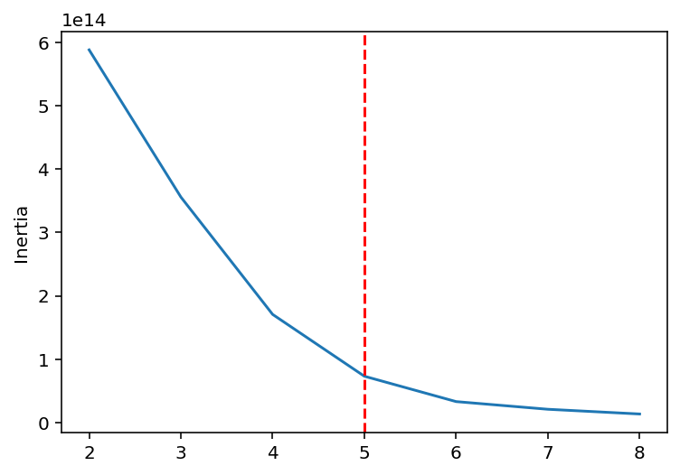
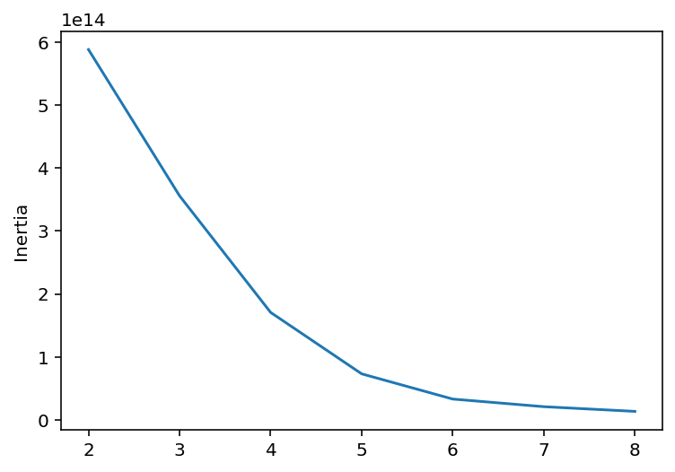
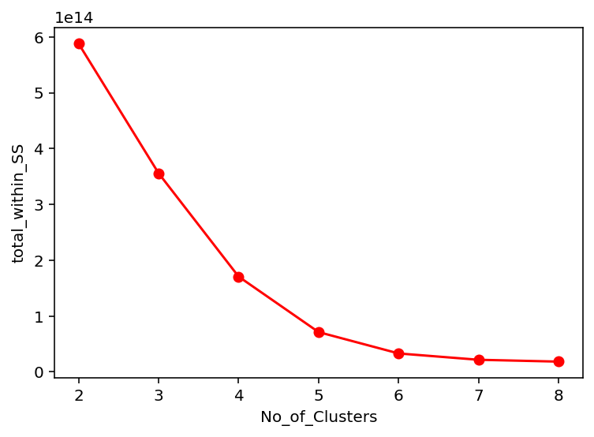
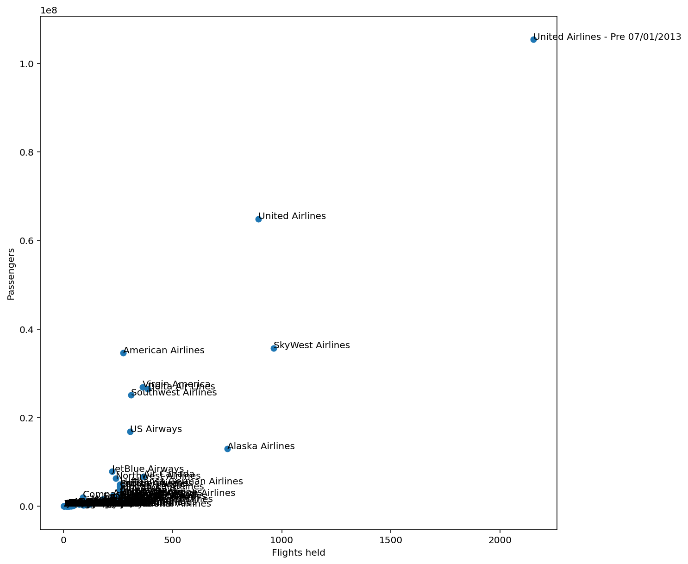

# ✈️ K-Means Clustering Project – Airline Passenger Analysis

## 📌 Project Overview

This project uses the **K-Means Clustering Algorithm** to analyze airline passenger and flight data.
The goal is to identify patterns among airlines based on:

* Number of flights held
* Total passengers
* Airline traffic behavior
* Similar airline groups (clusters)

This project demonstrates:

* Data preprocessing
* Exploratory Data Analysis (EDA)
* Elbow Method
* K-Means Clustering
* Cluster visualization
* Business insights generation

---

# 📂 Dataset

The dataset contains airline operational statistics including:

* Airline Name
* Flights Held
* Passenger Count
* Operational Metrics

---

# 🛠️ Technologies Used

* Python
* Pandas
* NumPy
* Matplotlib
* Seaborn
* Scikit-Learn

---

# 📊 Visualizations

## 1️⃣ Airline Flights vs Passengers Scatter Plot

This visualization shows the relationship between:

* Flights held by airlines
* Number of passengers

It helps identify:

* High traffic airlines
* Outliers
* Airline operational scale



### 🔍 Insights

* United Airlines handled the highest number of passengers.
* Some airlines operate fewer flights but still manage large passenger volumes.
* Smaller airlines are densely packed near the lower-left region.
* A few airlines act as major outliers because of very large operational scale.

---

## 2️⃣ Elbow Method (Within Sum of Squares)

The Elbow Method helps determine the optimal number of clusters for K-Means.



### 🔍 Insights

* WSS decreases rapidly from K=2 to K=5.
* After K=5, improvement becomes smaller.
* This indicates diminishing returns after 5 clusters.
* K=5 appears to be the optimal cluster count.

---

## 3️⃣ Inertia Curve

This graph shows how inertia changes with different cluster values.



### 🔍 Insights

* Inertia continuously decreases as clusters increase.
* The curve starts flattening near K=5.
* This supports the selection of 5 clusters.

---

## 4️⃣ Optimal Cluster Selection

The red dashed line highlights the selected optimal cluster count.



### 🔍 Insights

* The optimal number of clusters is selected as K=5.
* K=5 provides a balance between:

  * Low inertia
  * Better segmentation
  * Avoiding overfitting

---

# 🤖 Machine Learning Workflow

## Step 1: Data Collection

* Imported airline passenger dataset.

## Step 2: Data Cleaning

* Checked missing values
* Removed inconsistencies
* Selected important numerical features

## Step 3: Exploratory Data Analysis

* Scatter plots
* Distribution analysis
* Outlier identification

## Step 4: Feature Scaling

* Standardized data before clustering.

## Step 5: Elbow Method

* Determined optimal K value.

## Step 6: K-Means Clustering

* Trained clustering model.
* Grouped airlines into clusters.

## Step 7: Visualization

* Visualized clusters and model performance.

---

# 📈 Business Insights

* Airlines can be segmented into different operational categories.
* Large airlines dominate passenger traffic.
* Mid-size airlines form separate behavioral groups.
* Clustering helps identify:

  * Market leaders
  * Medium-scale competitors
  * Small operational airlines

---

# 🚀 Future Improvements

* Apply PCA for dimensionality reduction.
* Compare with Hierarchical Clustering and DBSCAN.
* Build interactive dashboards using Power BI or Tableau.
* Deploy clustering results using Streamlit.

---

# 📁 Repository Structure

```bash
K-Means-project-
│
├── Images/
│   ├── 01_airlines_scatter_plot.png
│   ├── 02_elbow_method_red.png
│   ├── 03_inertia_curve.png
│   └── 04_elbow_method_optimal_k.png
│
├── notebook.ipynb
├── dataset.csv
└── README.md
```

---

# 🎯 Conclusion

This project successfully demonstrates how **K-Means Clustering** can be used to analyze airline operational behavior and group airlines into meaningful clusters.

The project also highlights:

* Data preprocessing
* Cluster optimization
* Visualization techniques
* Business-oriented insights

---

# 👨‍💻 Author

**Lucky Singh**
Aspiring Data Scientist | Machine Learning Enthusiast
